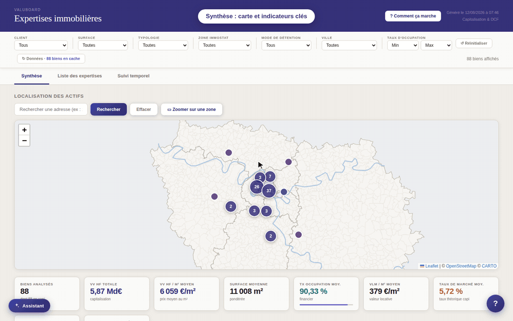

# ValuBoard — Dashboard d'analyse de portefeuille immobilier

**Tableau de bord HTML autonome** pour explorer, comparer et suivre dans le temps un portefeuille d'actifs immobiliers valorisés selon deux approches : Capitalisation et DCF. L'outil tient en une seule page, sans serveur ni installation, et fonctionne hors-ligne.

> ℹ️ **Ce dépôt est une vitrine.** Il présente le projet et son fonctionnement ; le code source n'est pas publié.

> ⚠️ **Données 100 % fictives et anonymisées.** Sociétés de gestion, fonds, immeubles et experts sont désignés par des codes neutres ; valeurs, loyers et taux ont été générés pour la démonstration à partir d'ordres de grandeur de marché. Aucune donnée réelle ni information confidentielle n'est présente.

---

## Fonctionnalités

- **Synthèse** : carte de l'Île-de-France avec regroupement des actifs, et 9 indicateurs clés (valeur vénale, prix au m², occupation, VLM, taux de marché, taux de sortie, travaux) recalculés en temps réel.
- **Filtrage croisé instantané** sur sept critères : société de gestion, surface, typologie, zone Immostat, mode de détention, ville, taux d'occupation.
- **Six graphiques** : rendement / prix au m², prix moyen par zone, répartition par typologie et par surface, distribution des taux d'occupation, comparaison Capitalisation vs DCF.
- **Liste triable et paginée**, avec sélection multiple pour comparaison.
- **Fiche détaillée par actif** : bascule Capitalisation / DCF, taux théorique, immédiat et potentiel, réversion, occupation financière et physique, éléments de correction (vacance, franchises, travaux), détail des lots et échéancier des travaux.
- **Comparaison côte à côte** de 2 à 4 actifs, avec mise en évidence de la meilleure valeur sur chaque indicateur.
- **Suivi temporel** en base 100 pour les actifs expertisés à plusieurs dates : valeur vénale, VLM, loyer, taux de rendement, occupation.
- **Visite guidée** au premier lancement et assistant de recherche en langage naturel (« bureaux à La Défense occupés à plus de 90 % »).
- **Fonctionnement hors-ligne** : fond de carte intégré, données conservées localement dans le navigateur, rien n'est envoyé vers un serveur.

## Architecture

Le projet se compose de deux couches :

- **Préparation des données** : un pipeline Python assure l'extraction, la normalisation et la fusion des sources, le géocodage des adresses, la dérivation des indicateurs et l'export au format JSON.
- **Visualisation** : une page HTML autonome, en JavaScript sans framework, avec [Leaflet](https://leafletjs.com/) pour la carte, [Chart.js](https://www.chartjs.org/) pour les graphiques et IndexedDB pour le cache local.

## Confidentialité

Ce projet est une vitrine : données inventées et anonymisées, habillage neutralisé, aucune référence à un outil interne ou à un client réel. Ni le code du dashboard ni le pipeline de traitement ne sont distribués.
